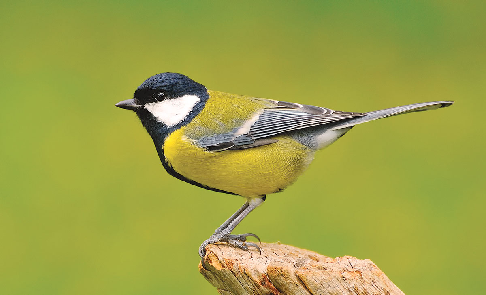

# Songbird

## Goal

This is a personal goal -- to read one research paper, article, blogpost, or tutorial every morning, the biggest part of my CS (mostly AI) journey to understand abstract ideas, problems, and ongoing research very well. The goal is to learn daily, and find myself and figure out what the most important and interesting probems are for me to work on in the future. This is for me to keep a personal, retrospective track of my learning, and for others (maybe people whom I might work with in the future) to look at my interests, my learning curve, and what I've recently been up to.

## Why Songbird?

<!--  -->

Songbirds lay eggs every day, usually in the mornings! Learning something new is like laying an egg -- it is a well-defined structure from which an "idea" will grow up that will, with time, manifest in ways one can never imagine. It will interact with other ideas, help them, play with them, give birth to new ideas with them, and eventually, like any other idea, will be lost forever. But it will leave the world (the brain) changed in its own very small way. And I once said

> Give me an idea good enough and the force with which to carry it, and I shall move the world.

## Note

This is a list of things that I though were good for me to read about, and a similarly created list will most likely be very different for you. So this should not be treated as a "list of fundamental, must-read papers" for everyone. That being said, it is a good list IMHO, and if you like it, feel free to pick stuff from here to read up. Lastly, note that this was dumped here from a `csv`, so the dates are messed up, but I guess they were not important in the first place.